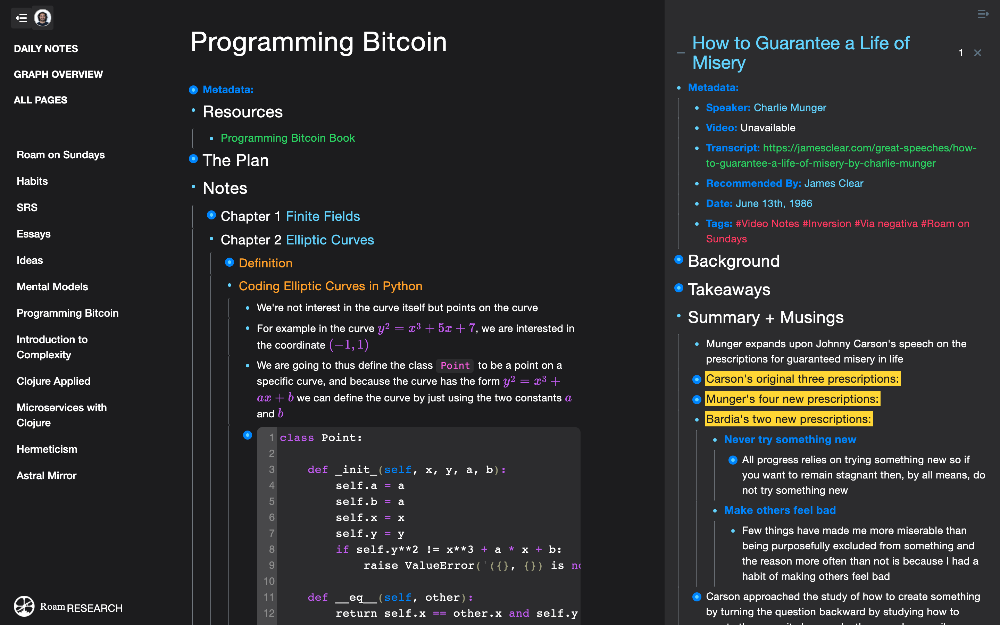

# Roam Apple Dark Mode

CSS Stylesheet for Roam Research that takes heavy inspiration from Apple's dark mode + a splash of color to make it like your favourite code editor.

## Screenshot

## Instructions (Chrome)

1. Copy the CSS stylesheet provided above to your clipboard

2. Download [Stylus Chrome Extension](https://chrome.google.com/webstore/detail/stylus/clngdbkpkpeebahjckkjfobafhncgmne?hl=en)

3. Navigate to your Roam Research page

4. Click the Stylus icon, and click 'Write style for: roamresearch.com/this_URL'

5. Paste your clipboard into the CSS editor and click 'Save'

## Acknowledgements

Thanks @devonzuegel for the base for this stylesheet.
